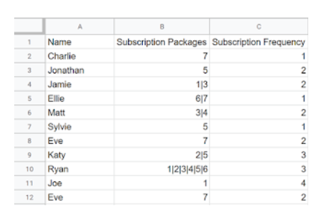
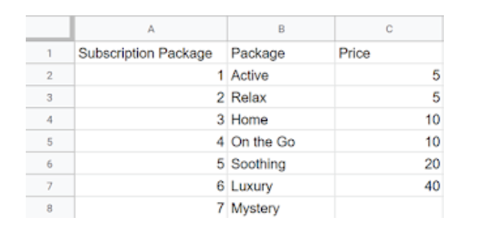
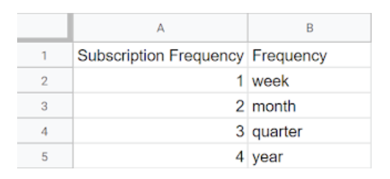

### 2019 Wk 29: C&BS Co: Subscription Packages

## Inputs (Sources)



Customer Table: 1 Row per Customer Detailing the Subscriptions the individual has and the frequency they have them delivered.



Subscriptions Table: 1 row for each subscription and the price it costs to produce once



Frequency Table: 1 row for each frequency converting a number to the frequency in date terms (weekly, monthly, yearly etc.)

## Requirements

- Input the data file
- Calculate the price of the mystery package **_Jonathan rounded the price down to provide value of money for Chin & Beard Suds Co customers_**
- Join back to original table containing product aliases and prices
- Calculate total cost of each customers subscription normalised on an annual basis
- Output the file

## DBT Actions

1. Read the data in using 'dbt seed'. Seeds make sense for static reference data and therefore make sense for the subscription mapping table.
   - Ideally the customers table and the price table would likely change over time in the real world. As such it would be more beneficial to set up source tables where freshness checks can be set up and snapshot methods can be used to capture slowly changing dimensions.
2. Staged the customer table using a lateral join to a flattened version of the table where we split on the '|'.

```sql

with source as (

    select * from {{ ref('source_pd2019wk29__customers') }}

),

-- split the package value into multiple rows within query using a lateral join to a flattened version of the file that splits based on the | delimeter.

transformed as (

    select

        name,
        package.value::int as package,
        frequency

    from source,
    lateral flatten(split(packages, '|')) package

)

select * from transformed
```
