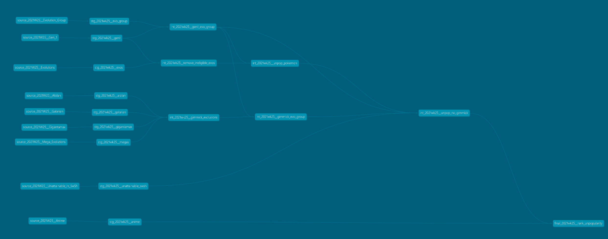

# Preppin Data 2021 Week 25: Worst Pokemon

## Challenge Context and Objective

This weeks challenge had a host of input files and a fairly singular objective a ranked list of most unpopular pokemon. This final output was 10 evolutionary groups that were from Generation 1 who do not have a Mega Evolution or a Regional Form and are unattainable in Sword and Shield. They are then ranked by their anime appearances.

## Approach

### Staging Gen 1 Pokemon

First I staged all the inputs, lots were simple select statements. The generation 1 input required concatenating a row for each type into a single row, I opted in the staging to get it into one row rather than simply dropping the column and grouping by so the table is reusable. This was a good opportunity to use the lag() function along with the listagg().

```sql

with source as (

    select * from {{ ref('source_2021W25__Gen_1') }}

),

-- add a recordID
add_id as (

    select

        * ,
        row_number() over (order by (select null)) as record_id

    from source

),

-- copy down dex number and name
with_dex_num as (

    select

        *,
        coalesce(num, lag(num) over (order by record_id asc)) as dex_num,
        coalesce(name, lag(name) over (order by record_id asc)) as poke_name

    from add_id

),

transformed as (

    select

        dex_num,
        poke_name,
        listagg(type, '/') within group(order by num) as type,
        max(total) as total,
        max(hp) as hp,
        max(attack) as attack,
        max(defense) as defence,
        max(sp_atk) as sp_atk,
        max(sp_def) as sp_def,
        max(speed) as speed

    from with_dex_num
    group by dex_num, poke_name

)

select * from transformed


```

### Using JINJA to build a SQL Union

The exclusions list of pokemon came from a range of sources unioned together. In this instance it made sense to use a 'for' loop in Jinja to iterate through a series of CTEs and union them together. I could have iterated the import CTEs but opted to keep them as individual code chunks for readability of a new developer opening up the model.

```sql

-- Import CTEs (all exclusion inputs)

with megas as (

    select * from {{ ref('stg_2021wk25__megas') }}

),

alolan as (

    select * from {{ ref('stg_2021wk25__alolan') }}

),

galarian as (

    select * from {{ ref('stg_2021wk25__galarian') }}

),

gigantamax as (

    select * from {{ ref('stg_2021wk25__gigantamax') }}

),

-- Union the list together and deduplicate a list of pokemon names (so use union rather than union all)



combined as (

    

    select poke_name from {{ cte }}

    

    union

    

    
)

select * from combined

```

The rest of the project involved joining the tables together - sometimes inner, sometimes left outer to reduce the list of pokemon down to 10 evolution groups - joining that table to the anime appearence chart and aggregating the number of appearences for each group.

The DAG for the project below does not necessarily follow all the best practice guidance around staging and joining of staging tables to intermediate models. I think with 9 inputs and the use of seeds rather than sources, the graph is messier and more inefficient than it would ideally be but I have posted it and the code as a point of transparency on what I can do better.


