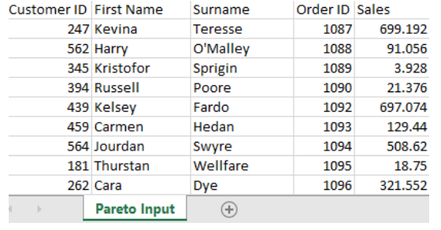

# 2022 Week 13 Preppin Data Pareto Parameters

## Challenge Goals

This challenge was designed to show off parameters and their use in Tableau Prep. Taking on the challenge with dbt does not map perfectly to the same toolset but it gives us the opportunity to use variables within our dbt project to achieve a similar result.

We have one input in this challenge, a sales table with a row for each order. The goal is to return a table at the level of customer showing their total sales, the % of total that the sales represents and then a running % of total sales down the table. This is to be filterable to a variable value of % of sales we wish to filter to.



The second output is a statement returning the % of customers responsible for the specified amount of sales.

## Approach to the Challenge

With just one input my approach was to stage the input and then work on two final tables that satisfy the challenge requirements.

Loading in the source table, I used CTEs to capture component parts that I will need including:

- a customer lookup table - with customer_id as a primary key and the additional name information required.
- a total sales value which is just the whole table aggregated to a single value to use later in % calculations.
- a customer sales table with the sales values summed and grouped by customer ID.

```sql

with source as (

    select * from {{ ref('source_2022wk13__pareto') }}

),

customer_names as (

    select

        customer_id,
        first_name,
        surname

    from source
    group by customer_id, first_name, surname

),

total_sales as (

    select

        sum(sales) as all_sales

    from source

),

customer_sales as (

    select

        customer_id,
        sum(sales) as sales_by_customer

    from source
    group by customer_id

),

transformed as (

    select

    customer_sales.customer_id,
    customer_sales.sales_by_customer,
    (customer_sales.sales_by_customer/total_sales.all_sales)*100 as pct_of_total,

    customer_names.first_name,
    customer_names.surname

    from customer_sales
    join customer_names on customer_names.customer_id = customer_sales.customer_id
    cross join total_sales

)

select * from transformed

```

The CTEs are then combined into a single table, 'transformed' that we select \* from. This table joins the customer_sales table to the customer_names lookup and cross joins the total sales value to every row of the table allowing us to complete the % of total calculation.

To make the first of the desired outputs I called on a variable 'filter-value' that is set in the project YAML and can be overwritten with the --vars option in command line. This variable is used at the end query in the where clause to filter the table. The only other transformation of note is computing the running sum of % of sales.

```sql

-- need a user value to alter a where clause



-- input CTEs

with sales_pct as (

    select * from {{ ref('stg_2022wk13__customer_sales') }}

),

-- add the running sum of pct

running_sales as (

    select

       customer_id,
       first_name,
       surname,
       sales_by_customer as sales,
       pct_of_total,
       round(sum(pct_of_total) over (order by pct_of_total desc), 2) as running_pct_total_sales

    from sales_pct

    order by pct_of_total desc


)

select * from running_sales
where running_pct_total_sales <= {{ var("filter_value") }}

```

The other output will require us to calculate the total number of customers pre-filter and then the count of customers after filtering to the % of sales in order to express the amount of customers responsible for the specified proportion of sales as a percentage.

```sql

-- Import CTEs

with customers as (

    select * from {{ ref('stg_2022wk13__customer_sales') }}

),

pareto as (

    select * from {{ ref('final_2022wk13__pareto') }}

),

total_customers as (

    select

        count(distinct customers.customer_id) as customer_count

    from customers

),

filtered_values as (

    select

        count(distinct pareto.customer_id) as filtered_count,
        round(max(running_pct_total_sales)) as pct_sales

    from pareto
),

final as (

    select

        total_customers.customer_count,

        filtered_values.filtered_count,
        filtered_values.pct_sales

    from total_customers
    cross join filtered_values

)

select

    (round((filtered_count/customer_count)*100)) || ' % of Customers account for ' || pct_sales || '% of Sales' as Outcome

 from final

 -- Example of DBT Command to Override the Variable

 -- dbt run -s +final_2022wk13__outcome --vars '{filter_value: 50}'

```

The final action concatenates the outcome into a statement as the challenge requires.

## Takeaways

This challenge mainly offered an opportunity to play with dbt variables within the project to cut the data at a customisable point and replicate the functionality of parameters in Tableau Prep.

Beyond that there was an opportunity to use the cross join function, window functions and some string functions to produce the final output.
