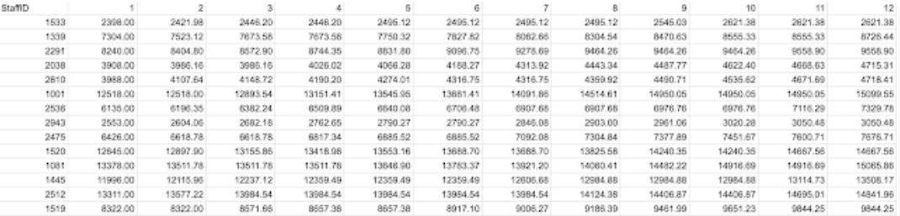

# Preppin Data 2024 Week 6: Staff Income Tax

## Context

One CSV Input for the staff of Prep Air's income, again in a human readable excel format with a column for each month that will need to be unpivotted.


## Staging

in the staging model we had a few tasks that needed to be completed such as adding a row number and correcting the datatype for month_1 from integer to float to avoid conflicting datatypes later in the pipeline when we pivot the data.

In the interest of future-proofing a pipeline, I actually think the model would be improved by casting all the month figures as Floats so they are robust to future data that might not include any dp values.

```sql
with source as (

    select * from {{ ref('source_pd2024wk6__input') }}

),

transformed as (

    select

        ROW_NUMBER() OVER (ORDER BY (SELECT NULL)) as id,
        staffid as staff_id,
        cast( month_1 as float ) as month_1, -- correct the datatype of month 1
        month_2,
        month_3,
        month_4,
        month_5,
        month_6,
        month_7,
        month_8,
        month_9,
        month_10,
        month_11,
        month_12

    from source

)

select * from transformed
```

## Intermediate Stage

The primary objective of the intermediate stage was to produce a table of annual salaries per employee that could be re-used in other areas of a Prep-Air dbt project. this was achieved with an unpivot and aggregation (sum) of the monthly salary values. We joined to a CTE of the most recent record for each staff-member to reduce the rows in the table to add a column to this table with the latest month the employee has an entry for to protect against if a staff member is added to the table without complete month information.

```sql
-- import cte

with month_salary as (

    select * from {{ ref('stg_2024wk6') }}

),

-- unpivot the salary

unpivot_salary as (

    select

    id,
    staff_id,
    name,
    value

    from month_salary
    unpivot(
        value for name in (month_1,month_2,month_3,month_4,month_5,month_6,month_7,month_8,month_9,month_10,month_11,month_12)
    )
),

-- identify the most recent record for each employee

recent_record as (

    select

    max(id) over (partition by staff_id) as recent_flag

    from unpivot_salary

),

-- return the final clean annual salary table

annual_salary as (

    select

    unpivot.id,
    unpivot.staff_id,
    sum(unpivot.value) as annual_salary

    from unpivot_salary as unpivot
    join recent_record on unpivot.id = recent_record.recent_flag
    group by id, staff_id
)

select * from annual_salary
```

## Final Modelling

The final modelling involved using case statements to add tax to the annual salary of employees. Including th etax paid in each band (as a high earner is also eligible for a portion of their salary to be tax-free). In all this was an exercise on crafting the case statements correctly and setting up the conditions in the right way.

```sql
-- materialize output as table

{{ config(materialized='table') }}

-- import cte

with salary as (

    select * from {{ ref("int_2024wk6")}}

),

tax as (

    select

    staff_id,
    annual_salary,
    case
        when annual_salary <=12570 then '0%'
        when annual_salary <=50270 then '20%'
        when annual_salary <=125140 then '40%'
        else '45%'
    end as max_band,
    case
        when annual_salary > 125140 then (annual_salary - 125140)*0.45
        else 0
    end as tax_45,
    case
        when annual_salary > 50270 and annual_salary <= 125140 then (annual_salary - 50270)*0.4
        when annual_salary > 50270 and annual_salary > 125140 then (125140-50270)*0.4
        else 0
    end as tax_40,
    case
        when annual_salary > 12570 and annual_salary <= 50270 then (annual_salary - 12570)*0.2
        when annual_salary >12570 and annual_salary > 50270 then (50270 - 12570)*0.2
        else 0
    end as tax_20,
    tax_45 + tax_40 + tax_20 as total_tax

    from salary

)

select * from tax
```
